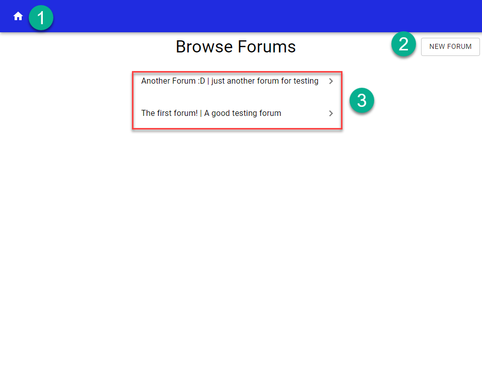
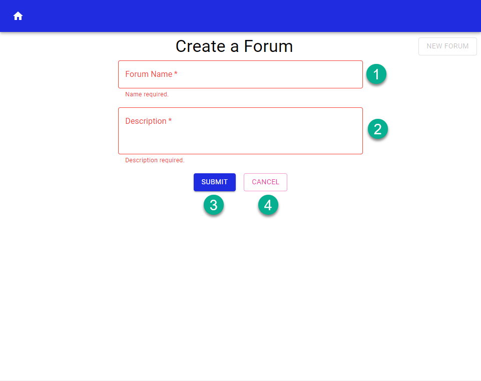
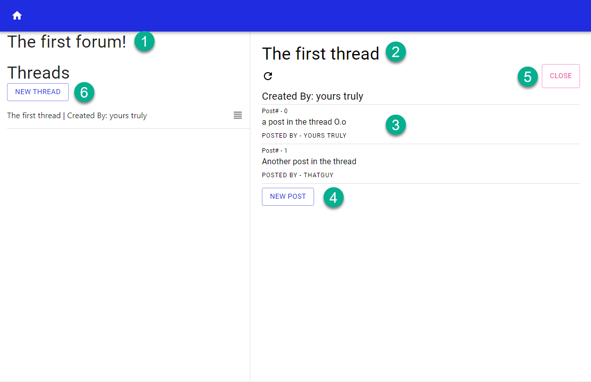
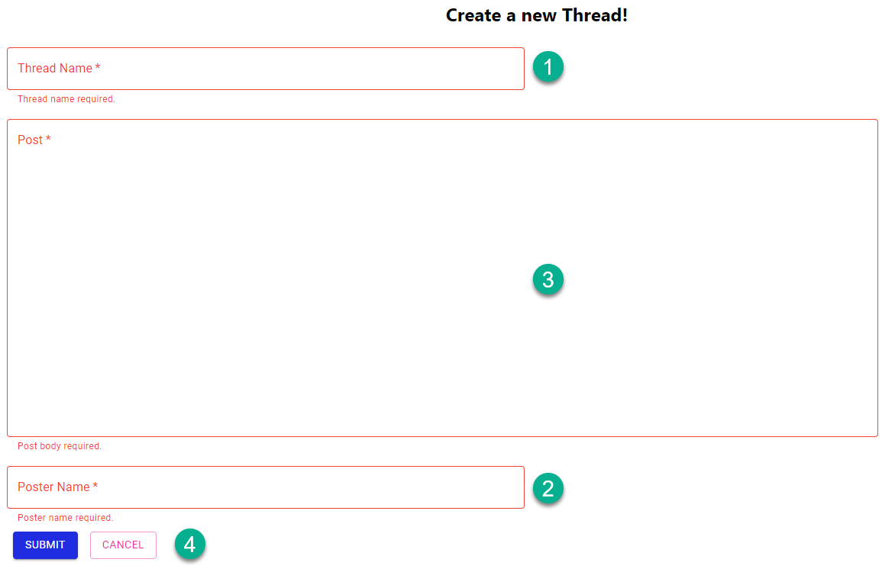
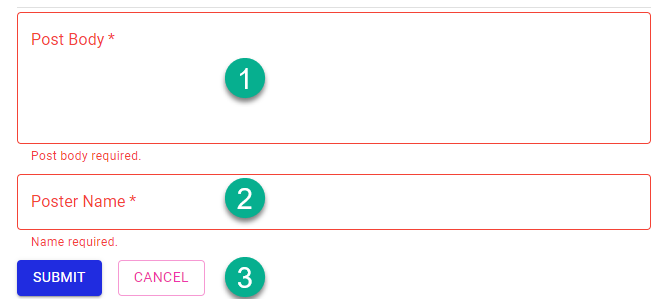

# Developer Challenge - Blockchain Forum

## Overview

This is a basic forum that uses blockchain to store and view data.  Users can create and browse the different
forums that have been created on the blockchain.  Though this is a basic example several things could be added in the future
to allow for more flexibility such as user authentication, timestamping of thread and post creation, and moderation privileges.

# How to run

## Install

Install the dependencies for both the frontend and backend.

1. Navigate to each directory.
2. Run the command `npm install`

## Run Locally

Open two terminals, we will run the backend in one and the frontend in the other.

1. Run backend in the first terminal.
    1. `cd backend`
    2. `npm start`
2. Run frontend in the second terminal.
    1. `cd frontend`
    2. `npm start`

# Frontend

## Browse Available Forums

1. <b>Home Button</b> - Returns the user to the forum browsing page.
2. <b>New forum</b> - Opens the new forum form.
3. <b>Forum List</b> - Displays forum name and description.  The button opens the associated forum view.
## Create New Forum

1. <b>Forum Name</b> - Name for the new forum.
2. <b>Description</b> - Description for the new forum.
3. <b>Submit</b> - Submits the new forum to be created.
4. <b>Cancel</b> - Closes the form without creating a new forum.
## View Thread

1. <b>Forum Name</b> - Displays the name of the forum being viewed.
2. <b>Thread Name</b> - Displays the name of the thread being viewed.
3. <b>Post View</b> - Displays all the posts on the thread.  Includes the post number, post body, and post creator.
4. <b>New Post</b> - Allows the user to create a new post.
5. <b>Close</b> - Closes the thread.
6. <b>New Thread</b> - Creates a new thread.

## Create New Thread

1. <b>Thread Name</b> - Name of the new thread.
2. <b>Post</b> - Content of the first post.
3. <b>Poster Name</b> - Name of the user posting the thread.
4. <em>Actions</em>
    1. <b>Submit</b> - Submits the new Thread.
    2. <b>Cancel</b> - Cancels the creation of the new thread.

## Create New Post

1. <b>Post Body</b> - Body of the new post.
2. <b>Poster Name</b> - Name of the person submitting the post.
3. <em>Actions</em>
    1. <b>Submit</b> - Creates the new post.
    2. <b>Cancel</b> - Cancels out of creating the new post.

# Backend

The backend was created with the intent to make the frontend actions as simple and as easy as possible.

The documentation for the backend API can be found here:

https://documenter.getpostman.com/view/4863482/TW6xo8Yx

I have included a postman collection as well under the path:

`readme-resources/Kaleido Challenge.postman_collection.json`